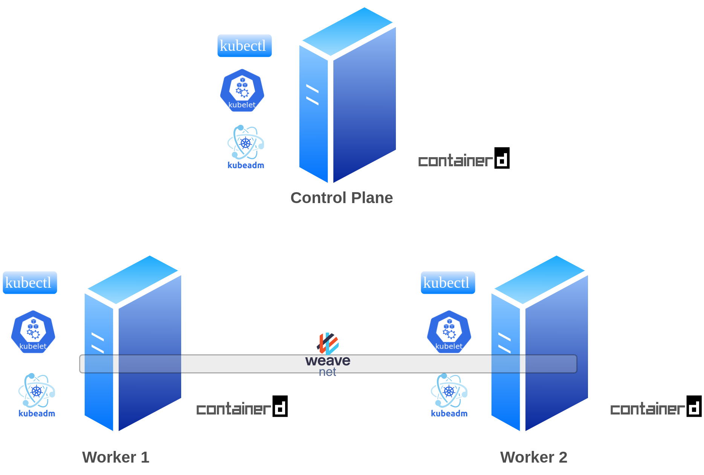

# Deploy Kubernetes Cluster on AWS EC2 Instances 🚀



## Overview

This repository provides scripts and Kubernetes manifest files to deploy a Kubernetes cluster on AWS EC2 instances. The installation follows a single control plane node and two worker nodes architecture. All nodes are equipped with containerd, kubeadm, kubectl, and kubelet.

For a detailed guide, check out the article on Medium: [Deploy Kubernetes Cluster on AWS EC2 Instances](https://mrmaheshrajput.medium.com/deploy-kubernetes-cluster-on-aws-ec2-instances-f3eeca9e95f1)

## Example Cluster Configuration

- Control Plane Node: `t2.medium` EC2 instance
- Worker Nodes: `t2.large` EC2 instances

## Installation

### 1. Containerd Installation

Run the following script on all nodes to install the containerd runtime:

```bash
./containerd-install.sh
```

### 2. Kubernetes Installation

Execute the following script on all nodes to install kubeadm, kubelet, and kubectl:

```bash
./k8s-install.sh
```

### 3. Ingress Example

Apply the provided Kubernetes manifest file for an example Ingress setup:

```bash
kubectl apply -f ingress-example.yaml
```

## Directory Structure

- `assets/img/` : Contains the installation workflow image.
- `containerd-install.sh` : Bash script for installing containerd runtime.
- `k8s-install.sh` : Bash script for installing kubeadm, kubelet, and kubectl.
- `ingress-example.yaml` : Kubernetes manifest file with 2 pods, 2 ClusterIP services, and 1 path-based routing Ingress service.


## Contribution

Feel free to contribute and improve the scripts or provide feedback. Open an issue or submit a pull request!

Happy Kubernetes Deploying! 👩‍💻👨‍💻